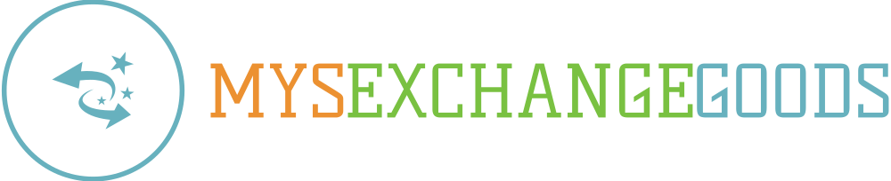

  
  
  
  

## 🖨️ 相关文档
在使用前请务必阅读文档，若有疑问，请先查阅文档或者Issues里是否有相同的问题

* [使用说明](https://github.com/GOOD-AN/Mys-Exchange-Goods/wiki/运行方法)
* [配置说明](https://github.com/GOOD-AN/Mys-Exchange-Goods/wiki/配置文件说明)
* [更新日志](./docs/CHANGELOG.md)
* [常见问题](https://github.com/GOOD-AN/Mys-Exchange-Goods/wiki/FAQ)
* [关于项目](./docs/ABOUT.md)

## 💬 交流反馈
请于[此页](https://blog.goodant.top/about/)下方的联系方式中交流 | **请优先使用QQ群**

## ❤️ 致谢
感谢 `Microsoft` 提供优秀的编辑器。

感谢 `JetBrains` 提供优秀的IDE。

## 🎺 声明

本项目遵循MIT协议，仅供学习使用，请勿用于非法用途！若使用中出现任何问题，本项目及其发起人与参与者不承担任何责任。
